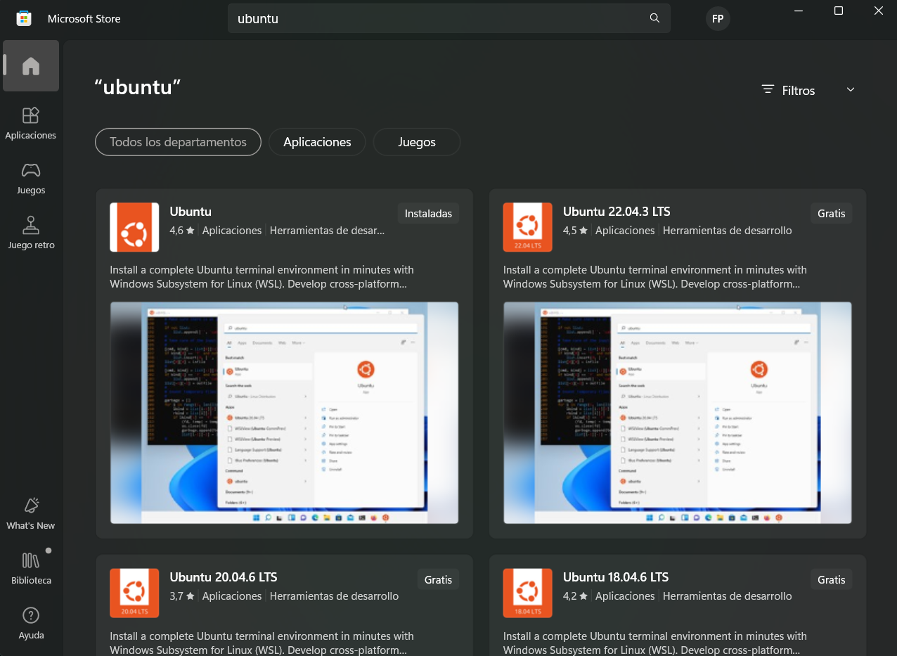
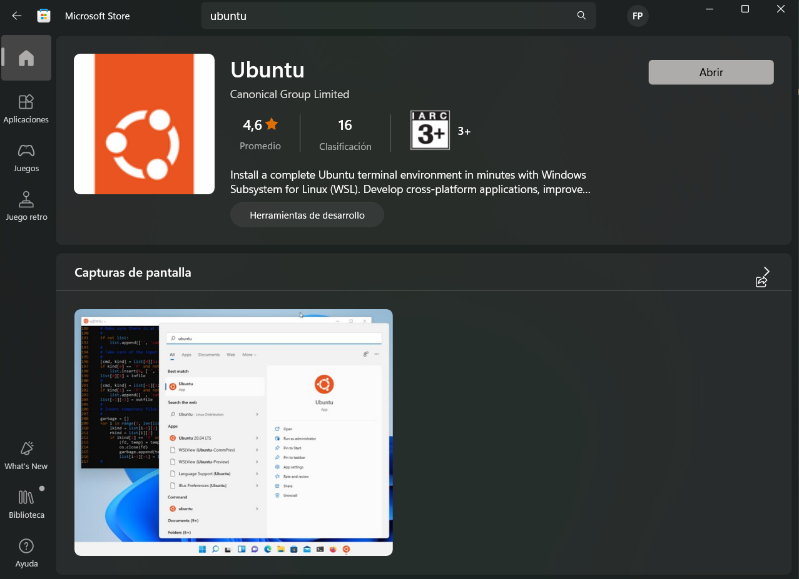

# Selección de maquina virtual

La selección y descarga de nuestra maquina virtual de Ubuntu la realizaremos directamente desde Microsoft Store, el cual se encuentra innstalado en nuestras maquinas Windows, por lo que solo necesitaremos abrirlo.

Luego de abrir el Microsoft Store, en la barra buscadorar vamos a poner **Ububtu** y seleccionaremos el primero que aparece que es de *Canonical Group Limited*. Al momento que seleccionemos la maquina virtual, se nos recargara brevemente la pagína y en la esquina superior derecha podremos ver un recuadro que dira **Obtener**, haremos clic en este recuadro y comenzara a descargarse la maquina virtual.

