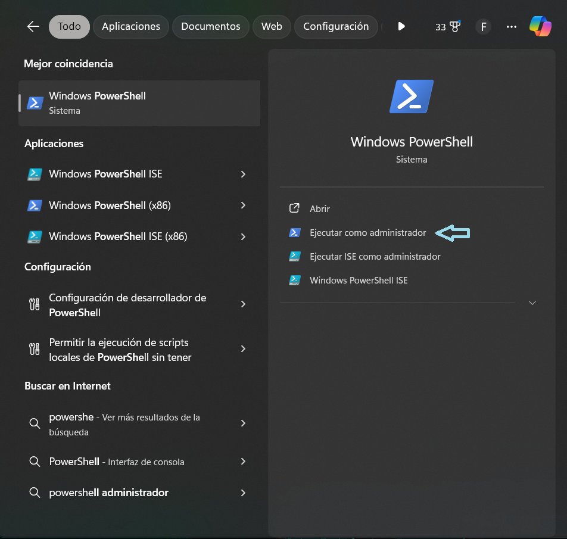
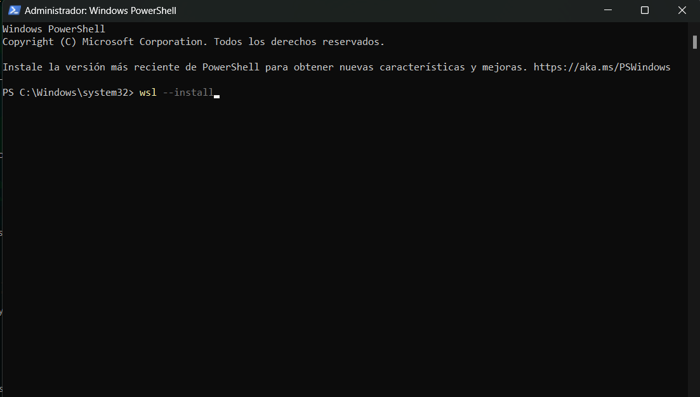

# Selección de máquina virtual

La selección y descarga de nuestra máquina virtual de Ubuntu la realizaremos directamente desde Microsoft Store, el cual se encuentra instalado en nuestras máquinas Windows, por lo que solo necesitaremos abrirlo.


Luego de abrir el Microsoft Store, en la barra buscadora vamos a poner **Ubuntu** y seleccionaremos el primero que aparece que es de *Canonical Group Limited*. Al momento que seleccionemos la máquina virtual, se nos recargara brevemente la página y en la esquina superior derecha podremos ver un recuadro que dirá **Obtener**, haremos clic en este recuadro y comenzará a descargarse la máquina virtual.


# Instalación de WSL

Mientras se descarga la máquina virtual, vamos a comenzar con la descarga del `WSL`, que es el programa que permite la comunicación entre la máquina virtual para poder comunicarse con Windows. Para instalar este debemos en el buscador de Windows buscar **PowerShell** y ejecutarlo como administrador.



Al abrir PowerShell, se nos desplegará una ventana de sí, le queremos conceder permiso como administrador, le damos a aceptar y se nos desplegará una pestaña de la terminal del sistema Windows, donde deberemos colocar `wsl --install`, para poder instalar el sistema WSL.



Al finalizar la instalación del WSL, es muy probable que la máquina virtual de Ubuntu ya se haya descargado, pero **OJO** aún no abrir Ubuntu. Antes de realizar esto debemos reiniciar el equipo para que pueda finalizar la instalación del WSL. Finalmente, post reinicio podremos abrir Ubuntu, el cual nos debería pedir ingresar un usuario y posteriormente una clave. **Importante** al momento de anotar el usuario, puede ser cualquier nombre que le quieras poner, no es necesario que sea el mismo que el nombre que le pusiste a tu equipo al momento de iniciar por primera vez tu computador post, compra o formateo. Pero lo más importante viene al momento de poner la clave de usuario. **Al escribir la clave esta no sé y además el sistema de Ubuntu no te muestra si estas o no escribiendo, por lo que es estrictamente necesario estar muy atento en este paso y 1) tener claro la clave que se va a colocar 2) no olvidarse de la clave, mantenerla anotada en algún lugar de no fácil acceso** todo esto debido a que en algunos casos se requiere forzar la instalación de cosas o bien el sistema como no se ejecuta como administrador pedirá esta clave para modificación de archivos que puedan comprometer al SO de Ubuntu.
# Instalación de Conda

Conda es un gestor de ambientes, los ambientes son entornos virtuales que permiten gestionar de forma independiente los paquetes que uno descargue en esos ambientes, paquetes que poseen funciones para el análisis de secuencias genéticas.

Para instalar Conda a través de la consola necesitaremos `wget` para obtener el archivo

````{bash}
bash Anaconda3-2021.11-Linux-x86_64.sh
````
Una vez descargado el archivo será necesario correrlo para que pueda instalarse conda en Ubuntu

````{bash}
bash Anaconda3-2021.11-Linux-x86_64.sh
````
Finalizada la instalación deberemos reiniciar la consola (cerrar y abrir de nuevo Ubuntu) para que se finalice la instalación. Para corroborar que esté instalado debemos ocupar el siguiente código `conda --version` que nos deberá entregar la versión de conda instalada en nuestro sistema.

Luego de corroborar que esta conda instalado, podremos crear ambientes y activarlos, para poder descargar los paquetes que vayamos a utilizar en ese ambiente.

Otra opción podría ser utilizar los siguiente comandos

````bash
mkdir -p ~/miniconda3
wget https://repo.anaconda.com/miniconda/Miniconda3-latest-Linux-x86_64.sh -O ~/miniconda3/miniconda.sh
bash ~/miniconda3/miniconda.sh -b -u -p ~/miniconda3
rm -rf ~/miniconda3/miniconda.sh
````

**Creación de ambiente**
````bash
conda create -n <nombre_ambiente>
````

**Activación del ambiente**
````bash
conda activate <nombre_ambiente>
````

**Descarga paquete**
En este punto hay que estar atento: 
1) Cuando instalas un paquete con una ambiente activado, este paquete quedara en ese ambiente alojado, por lo que si quieres ocupar su función, tendrás que activar el ambiente para poder hacerlo.
2)  Dependiendo del paquete este se instalara directamente por conda o bien se necesitara instalar por bioconda de la siguiente manera
````bash
#conda directamente
conda install <nombre_del_paquete>

#bioconda
conda install -c bioconda <nombre_del_paquete>
````
> Se sugiere saber de ante mano como se instala el paquete o bien probar con uno de los dos métodos mencionados anteriormente

**Desactivar el ambiente**
````bash
conda deactivate
````

Con esto ya debería quedar funcionando de buena manera la máquina virtual de Ubuntu y Conda para realizar los análisis :D.

